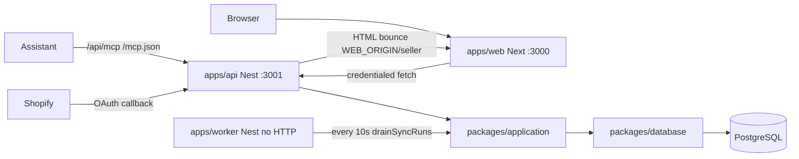

# NestJS monorepo split

Next.js today is a thin HTTP shell over `[src/server](src/server)`. The domain does not import Next. This slice moves that code into the reference workspace layout and gives HTTP, UI, and outbox drain each their own process.

## Locked decisions

- Split origin: web `http://127.0.0.1:3000`, API `http://127.0.0.1:3001`, worker has no port
- All current HTTP backends move off Next in this slice
- Reference tree is the **target layout**, not a license to invent missing product
- **In:** `apps/web`, `apps/api`, `apps/worker`, `packages/{database,contracts,application,config}`
- **Out:** Shopify webhooks, new MCP tools, nginx, Dockerfiles, compose, `.github` deploy, empty `features/catalog` pages

## Approaches considered

- Single package, `srcus/api` next to `src/app` — rejected in favor of this workspace
- Scaffold the entire reference tree including stubs — rejected; map existing code only
- Next rewrite/proxy of `/api` — rejected; cookies live on the Nest origin

## Target shape



Three processes, one database. Worker replaces `POST /api/cron/sync`. Seller retry and OAuth still `enqueueSync`; the worker is what drains.

## Workspace layout (what we actually create)

pnpm workspaces (`pnpm-workspace.yaml`: `apps/*`, `packages/*`). Root `package.json` only has workspace scripts. `[tsconfig.base.json](tsconfig.base.json)` holds shared `paths` / `strict`. Each package exports via `"exports"` and `workspace:*`.

```text
apps/web/          # current Next UI (pages, components, public)
apps/api/          # Nest HTTP + MCP
apps/worker/       # Nest, no listen(); outbox drain loop
packages/database  # drizzle client, schema, migrations
packages/contracts # zod/types only (catalog, merchants, common)
packages/application # catalog, merchants, sync, outbox, shopify OAuth, connectors, auth session, MCP tool runners
packages/config    # typed env: WEB_ORIGIN, API_PORT, DATABASE_URL, SESSION_SECRET, Shopify
```

Internal names: `@shopping-mcp/web`, `@shopping-mcp/api`, `@shopping-mcp/worker`, `@shopping-mcp/database`, `@shopping-mcp/contracts`, `@shopping-mcp/application`, `@shopping-mcp/config`.

Do not create `infrastructure/`, Dockerfiles, nginx, or GitHub deploy workflows in this slice.

## Package mapping from today’s tree

| Today                                                                                                                                                                                                                | Goes to                          |
| -------------------------------------------------------------------------------------------------------------------------------------------------------------------------------------------------------------------- | -------------------------------- |
| `[src/server/db/client.ts](src/server/db/client.ts)`, `[schema.ts](src/server/db/schema.ts)`, `[db/migrations](db/migrations)`, `[drizzle.config.ts](drizzle.config.ts)`, `[scripts/migrate.ts](scripts/migrate.ts)` | `packages/database`              |
| `[src/shared/catalog-schema.ts](src/shared/catalog-schema.ts)`, `[connectors/contract.ts](src/server/connectors/contract.ts)` types, `[merchant-status.ts](src/server/merchants/merchant-status.ts)`                 | `packages/contracts`             |
| catalog/merchants/sync/outbox/auth/shopify hmac+credentials+connect+callback, connectors, MCP `run*Tool`                                                                                                             | `packages/application`           |
| env reads scattered in session, cron-auth, shopify, db                                                                                                                                                               | `packages/config`                |
| `[src/app/**](src/app)` UI only                                                                                                                                                                                      | `apps/web/src/app`               |
| Next `/api/**` route files                                                                                                                                                                                           | deleted; re-hosted in `apps/api` |
| `[authorizeCron](src/server/sync/cron-auth.ts)` + `[/api/cron/sync](src/app/api/cron/sync/route.ts)`                                                                                                                 | deleted; worker drain loop       |

Keep function names and signatures where tests already call them (`searchProducts`, `handleShopifyConnect`, `drainSyncRuns`, `getDashboardMerchant`, …). Move first, then wrap. Do not rewrite Drizzle queries or invent Nest repositories that duplicate `packages/application`.

## apps/api — Nest HTTP + MCP

One Nest app, modules that match the reference **where we have behavior**. Controllers stay thin; services delegate to `@shopping-mcp/application`. Do **not** add a second `catalog.repository.ts` inside the API — the repository stays in `packages/application`.

```text
apps/api/src/
  main.ts                         # 127.0.0.1:API_PORT, rawBody, CORS credentials
  app.module.ts
  fetch-adapter.ts                # Express req → Fetch Request (Shopify + MCP)
  health/health.controller.ts     # GET /health
  catalog/                        # GET /api/products
  merchants/                      # GET /api/merchants
  auth/                           # GET /api/seller, POST /api/seller/sync, POST /api/seller/disconnect
  integrations/shopify/           # POST /api/shopify/connect, GET /api/connections/shopify/callback
  mcp/                            # GET|POST /api/mcp, GET /mcp.json
    tools/                        # existing four tools only
```

Create **none** of: `shopify.webhook.controller.ts`, `merchant-status.tool.ts`.

Shopify connector/mapper/client used by sync live in `packages/application` (worker must import them). `apps/api/integrations/shopify` is OAuth HTTP only.

Keep pathnames: `/api/products`, `/api/merchants`, `/api/shopify/connect`, `/api/connections/shopify/callback`, `/api/seller`, `/api/seller/sync`, `/api/seller/disconnect`, `/api/mcp`, `/mcp.json`. Drop `/api/cron/sync`.

CORS:

```ts
app.enableCors({
  origin: process.env.WEB_ORIGIN, // http://127.0.0.1:3000
  credentials: true,
});
```

## apps/worker — outbox drain, no HTTP

```text
apps/worker/src/
  main.ts                 # NestFactory.createApplicationContext; do not listen
  worker.module.ts
  processors/outbox.processor.ts
```

`outbox.processor.ts` calls `drainSyncRuns({ limit: 1 })` every 10 seconds (simple interval or `@nestjs/schedule`). That function already runs `syncConnection`; do **not** add `catalog-sync.processor.ts` or `webhook.processor.ts`.

`CRON_SECRET` and `authorizeCron` go away. Seller retry remains `POST /api/seller/sync` → `enqueueSync`.

## apps/web — UI only

Move the existing Next app. Do **not** invent `features/catalog` or `features/merchants` pages.

```text
apps/web/src/
  app/                    # current routes: /, /seller, /docs, /privacy
  components/             # header, footer, store-connection
  lib/api/                # apiUrl() from NEXT_PUBLIC_API_ORIGIN
```

`127.0.0.1:3000` and `:3001` are cross-origin, same-site. `SameSite=Lax` cookies work if Nest sets them and the browser calls Nest with `credentials: "include"`.

Cookie cutover (unchanged from the last plan, new paths):

- `[handleShopifyCallback](src/server/shopify/callback.ts)` HTML bounce becomes `${WEB_ORIGIN}/seller` (relative `/seller` would hit the API)
- Keep 200 HTML + `Set-Cookie` (not 302)
- Add `GET /api/seller` → `getDashboardMerchant(cookieHeader)`
- `[StoreConnections](src/app/(seller)`/_components/store-connection.tsx) loads/refreshes via `apiUrl` + credentials; sync/disconnect become `fetch` + reload, JSON `{ ok: true }` (no 303)
- Seller page drops `cookies()` / `getDashboardMerchant`
- Home/docs MCP download → `${NEXT_PUBLIC_API_ORIGIN}/mcp.json`

New env (`[.env.example](.env.example)`):

- `API_PORT=3001`
- `WEB_ORIGIN=http://127.0.0.1:3000`
- `NEXT_PUBLIC_API_ORIGIN=http://127.0.0.1:3001`
- `SHOPIFY_REDIRECT_URI=http://127.0.0.1:3001/api/connections/shopify/callback`

Remove `CRON_SECRET`. Update the Shopify app redirect URL.

Root scripts: `pnpm --filter @shopping-mcp/web dev`, `...api`, `...worker`, plus `dev` that runs all three. Bind web and api to `127.0.0.1`.

## Testing (TDD)

Keep the existing `tsx --test` style. After the move, tests import `@shopping-mcp/application` / `@shopping-mcp/contracts` instead of `@/server/...`. Update [tests/boundaries.test.ts](tests/boundaries.test.ts) so `apps/web` client/shared still cannot import application/database.

1. **RED first:** `GET /api/seller` without cookie → `200` + `null` (new Nest contract)
2. Products invalid query → 400 (API HTTP test via `@nestjs/testing` + `supertest`)
3. Worker: one test that the processor calls `drainSyncRuns` (fake clock or inject a drain fn) — not a file-layout test
4. CORS: credentialed request from `WEB_ORIGIN` gets allow-origin + credentials
5. Callback HTML contains absolute `${WEB_ORIGIN}/seller` — update [tests/integration/shopify-connect.test.ts](tests/integration/shopify-connect.test.ts)
6. Remove or rewrite [tests/cron-sync.test.ts](tests/cron-sync.test.ts); bearer cron is gone

Do not test that `src/app/api` “does not exist.”

## Out of scope

- Nest `ValidationPipe` / class-validator (keep Zod in contracts/application)
- Public auth / tenant isolation
- Shopify webhooks, extra MCP tools, catalog/merchant feature folders with no pages
- Docker, nginx, compose, CI/deploy workflows
- Rewriting SQL or sync semantics beyond moving the drain into the worker
